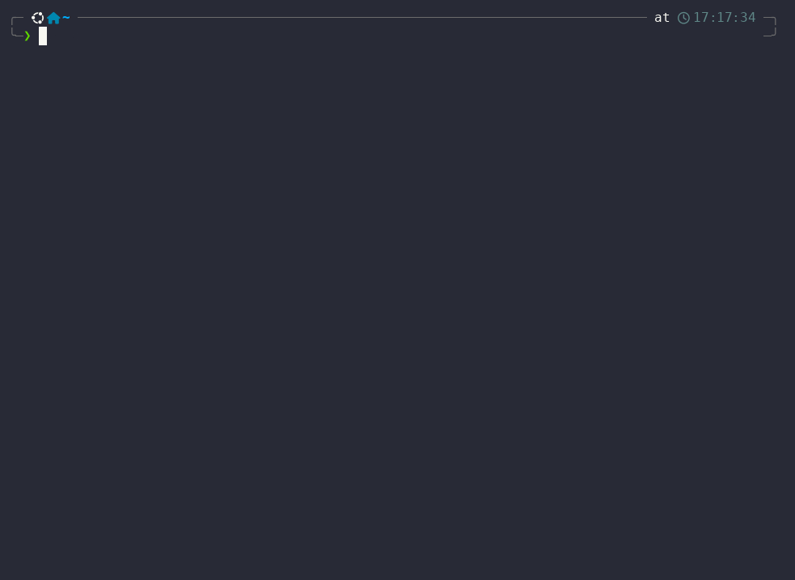

# isamedia

A terminal client for your media stack: browse and play your Jellyfin library
in [mpv](https://mpv.io), and manage your Radarr movies and Sonarr series,
without leaving the terminal.

isamedia is a Rust rewrite and extension of
[jfsh](https://github.com/hacel/jfsh), keeping feature parity while adding a
multi-app shell and non-blocking playback (the UI stays interactive while mpv
runs).



## Features

### Jellyfin

- Resume / Next Up / Recently Added / Libraries / Search tabs, series and
  season drill-down, client-side filtering, a sort menu and an info panel.
- Watched toggling that reports straight back to the server.
- Audio and subtitle language preferences, with per-show overrides.

### Radarr and Sonarr

- Add movies and series, delete them (with or without files), toggle
  monitoring, and edit options (quality profile, root folder, and so on).
- A downloads queue with bulk removal, interactive release search, and
  tracked auto-search that keeps you posted while it runs.

### Playback (mpv)

- Uses your own mpv config: direct play, resume from the last position,
  whole-series playlists for episodes, automatic progress reporting back to
  Jellyfin, media segment skipping (intro/outro), and external subtitles.
- Non-blocking: keep browsing while something plays. A status bar shows the
  current item and position, and `s` stops playback.

### Shell and Settings

- Switch between the visible tabs with `ctrl+←/→` or `ctrl+1..9`. A backend's
  tab only appears once it is configured in Settings, so on a fresh install
  Settings is the only tab. Each app owns its own keymap; press `?` in any
  tab for the always-accurate contextual help.
- The Settings tab covers the theme and accent, backend credentials
  (Jellyfin, Radarr and Sonarr), and the Jellyfin language preferences. Each
  backend row also offers Remove, which clears the host from the config,
  deletes the stored credentials from the keyring, and hides the tab again.
- Log in once; the token is stored in the OS keyring (Secret Service on
  Linux, Credential Manager on Windows) and reused on later runs.

## Requirements

- mpv in `PATH` (see [installing mpv](https://mpv.io/installation/))
- A Jellyfin server (10.9+; media segment skipping needs 10.10+, which added
  the `/MediaSegments` API)
- Optionally, a Radarr (v3+) and/or Sonarr (v4) server for the *arr tabs;
  each speaks the v3 API
- On Linux: a Secret Service keyring (GNOME Keyring or KWallet, present on
  any normal desktop) for storing credentials

## Build

```sh
cargo build --release
./target/release/isamedia
```

To install it as a command on your PATH (into `~/.cargo/bin`):

```sh
cargo install --locked --path .
isamedia
```

`--locked` reuses the exact dependency versions from `Cargo.lock`. The binary
is a snapshot, so re-run the command to pick up later source changes; remove
it with `cargo uninstall isamedia`.

Linux and Windows are supported (macOS should work too, but is untested).

## Usage

```
isamedia [OPTIONS]
  -c, --config <FILE>  config file path
  -d, --debug <FILE>   debug log file path (enables debug logging)
  -V, --version        print version
```

### Keys

Every app owns its own keymap, so the surest reference is the contextual help
overlay: press `?` in any tab. It is generated from the same data as the
status bar, so it can never drift from what the keys actually do. The tables
below cover the common cases.

**Common**

| Key | Action |
| --- | --- |
| `ctrl+c` | quit |
| `ctrl+←/→` | previous / next visible app |
| `ctrl+1..9` | jump to the Nth visible tab (fixed order: Jellyfin, Radarr, Sonarr, Settings; numbers compact over the tabs that are shown) |
| `↑` `↓` | move selection |
| `←/→` or `pgup/pgdn` | previous / next page (in lists) |
| `g` / `home`, `G` / `end` | start / end of list |
| `enter` | open or confirm |
| `esc` / `backspace` | back |
| `/` | search or filter the current list |
| `r` | refresh |
| `?` | contextual help overlay |
| `ctrl+u` | clear the focused input |
| `q` | quit (when not typing into an input) |

**Jellyfin**

| Key | Action |
| --- | --- |
| `tab` / `shift+tab` | switch content tab (Resume / Next Up / Recently Added / Libraries / Search) |
| `enter` / `space` | play, or open a series / season |
| `w` | toggle watched |
| `i` | info panel |
| `v` | open the sort menu (in a collection) |
| `s` | stop playback |
| `y` / `n` | confirm / cancel the replace-playback prompt |

**Radarr and Sonarr**

| Key | Action |
| --- | --- |
| `a` | add a movie / series |
| `enter` | open; on a movie or episode, open the search menu (auto or interactive) |
| `m` | toggle monitored |
| `o` | edit options |
| `v` | sort menu |
| `i` | expand overview / episode info |
| `d` | open the downloads queue |
| `x` | delete file, remove from the queue, or show release rejections |
| `z` | delete the movie / series |
| `space` | mark an item in the downloads queue |

**Settings**

| Key | Action |
| --- | --- |
| `↑` `↓` | move between rows |
| `enter` | open a row or submenu entry; in a form, save or advance |
| `←/→` | cycle a select field in a credential form |
| `tab` | move between form fields |
| `esc` | back out of a form or submenu |
| `y` / `n` | confirm / cancel removing a backend |
| type | filter the language picker |

A backend row opens a small submenu: Credentials (the host and secret form),
Language (Jellyfin only), and, once the backend is configured, Remove.

## Configuration

`~/.config/isamedia/config.toml` on Linux (`%APPDATA%\isamedia\config\` on
Windows), created on first run. On first start only the Settings tab is
visible: configure a backend there (host and credentials) and its tab
appears; after that the stored token is used on every launch.

```toml
last_app = "jellyfin"
theme = "latte"            # "latte" or "solarized-light"
accent = "rosewater"       # latte accents: rosewater, mauve, green, sky, lavender

[jellyfin]
host = "https://jellyfin.example.com"   # http(s), base paths supported
username = "me"
device = "hostname"
device_id = "..."          # generated
user_id = "..."            # managed automatically
skip_segments = []         # e.g. ["Intro", "Outro", "Recap", "Preview", "Commercial"]
# Optional language preferences (usually set from the Settings tab).
# Each is "default", "off", or an ISO 639-2/B code such as "ita".
audio_language = "default"
subtitle_language = "off"

[radarr]                   # optional; omit if you don't use Radarr
host = "https://radarr.example.com"

[sonarr]                   # optional; omit if you don't use Sonarr
host = "https://sonarr.example.com"
```

Per-show audio and subtitle overrides are kept in a `language_overrides.json`
file next to `config.toml`, managed automatically.

The config file holds no secrets. Credentials live in the OS keyring under the
`isamedia` service: the Jellyfin session token and optional password
(`jellyfin-token` / `jellyfin-password`), plus the Radarr and Sonarr API keys
(`radarr-api-key` / `sonarr-api-key`). The Jellyfin password is optional and
only used to re-authenticate automatically when the token expires; leave the
field empty at login to not store one.

### mpv config

isamedia plays in your own mpv and uses your global mpv config (it does not pass
`--no-config`), so any tuning lives in your mpv config, not in isamedia. A
ready-to-use setup ships in [`contrib/mpv/`](contrib/mpv): a ModernZ on-screen
controller theme, custom keybindings that pair with the app, and a contextual
Skip button for chaptered files.

It is optional. To adopt it, install mpv (see
[installing mpv](https://mpv.io/installation/)), back up any existing mpv config,
then copy the folder into your mpv config directory:

```sh
mkdir -p ~/.config/mpv
cp -r contrib/mpv/. ~/.config/mpv/
```

On Windows, mpv reads `%APPDATA%\mpv\` instead. Read
[`contrib/mpv/input.conf`](contrib/mpv/input.conf) to see and customise the full
set of keybindings, and [`contrib/mpv/README.md`](contrib/mpv/README.md) for what
each file does and the third-party licensing.

### Themes

Two light themes ship: Catppuccin Latte (default) and Solarized Light. Open the
Settings tab (the last tab, e.g. `ctrl+1` on a fresh install or `ctrl+4` with
every backend configured), press `enter` on a row to open its choice list, pick
with the arrow keys and `enter`. Catppuccin Latte also offers five accent
colours (rosewater, mauve, green, sky, lavender); Solarized Light has none.
Selections are saved to `theme` and `accent` in the config. Both are light
themes that only set foreground colours and leave your terminal's own background
alone, so they look best on a light terminal.

## Development

```sh
cargo test                       # unit tests
cargo test demo_server -- --ignored   # smoke test against demo.jellyfin.org
cargo clippy --all-targets
```

### Git hooks

A committed `pre-commit` hook rejects a commit whose staged Rust changes are
not `rustfmt`-clean or trip clippy. Enable it once per clone:

```sh
git config core.hooksPath .githooks
```

When a `.rs` file is staged the hook runs `cargo fmt --all --check` first,
then `cargo clippy --all-targets -- -D warnings`. Bypass it in an emergency
with `git commit --no-verify`.

Architecture notes: one central event loop (tokio mpsc channel); all state
mutation is synchronous in the shell loop, every await lives in a spawned
task. Apps implement the `MediaApp` trait (`src/app.rs`); adding a new app
means writing its module under `src/apps/` and registering it in
`src/apps/mod.rs::build_apps`. mpv is driven over its JSON IPC socket by a
supervisor task (`src/player/supervisor.rs`).

## Credits

Behaviour, keybindings and the Jellyfin/mpv integration are ported from
[jfsh](https://github.com/hacel/jfsh) by hacel (public domain / Unlicense).

The bundled mpv config in [`contrib/mpv/`](contrib/mpv) ships
[ModernZ](https://github.com/Samillion/ModernZ) by Samillion (LGPL-2.1), a modern
mpv on-screen controller derived from mpv's `osc.lua` via maoiscat's
mpv-osc-modern and the ModernX forks. Its licence text is kept alongside it in
`contrib/mpv/LICENSE-ModernZ`.

